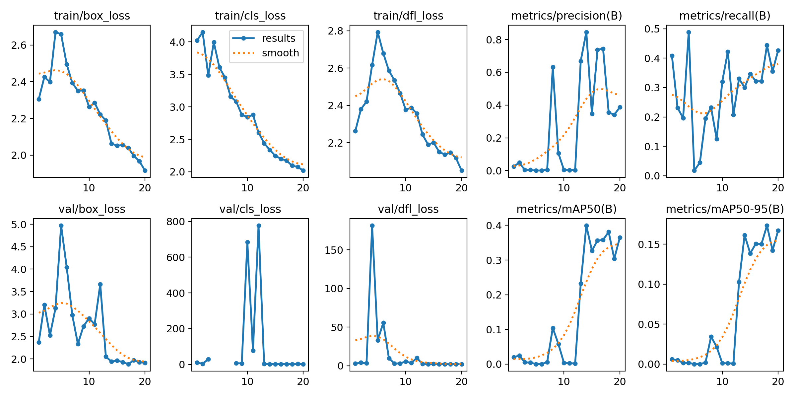
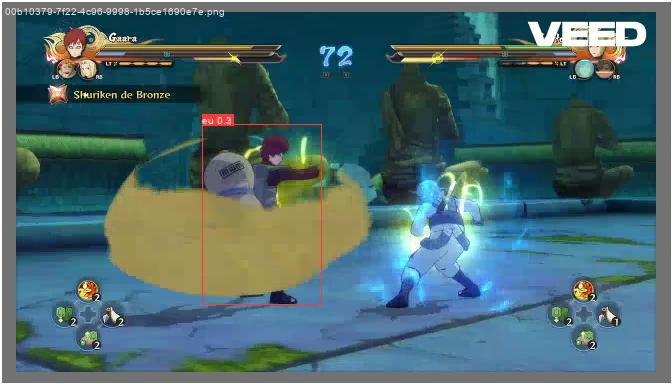
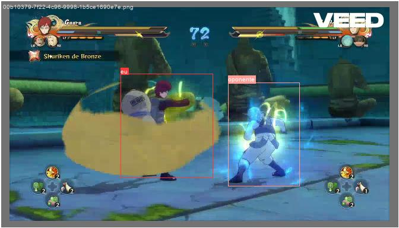
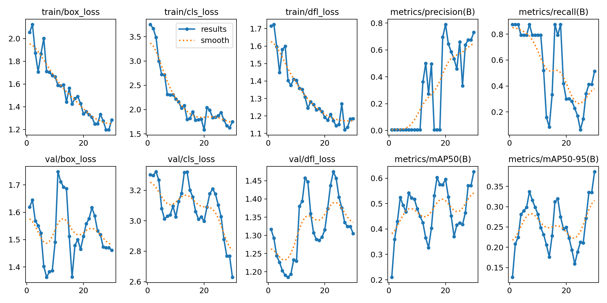
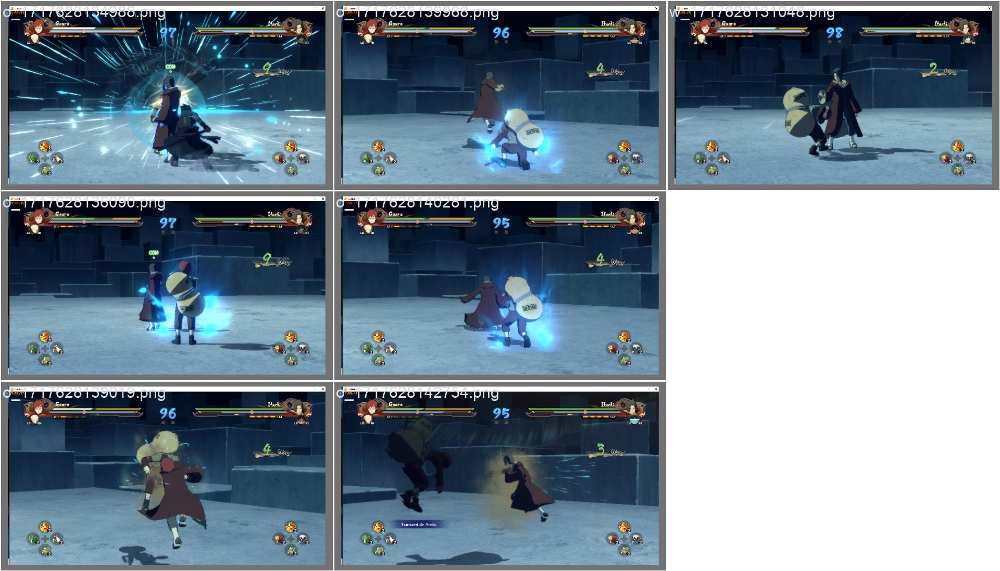
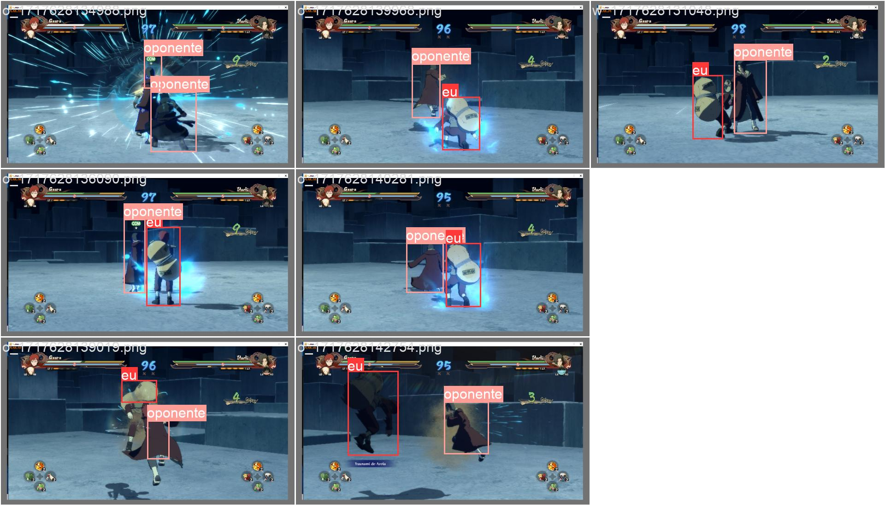

#           N-A-I
#
# 📚 Naruto Artificial inteligence
- NAI 45 imagens (Available for download and use)
- NAI 156 imagens (Available for download and use)
- NAI 845 imagens (train)
- NAI 2k imagens (train)

## index model

- [NAI 45 imagens](#NAI-45-imagens)
- [NAI 156 imagens](#NAI-156-imagens)
- [NAI 845 imagens](#NAI-845-imagens)
- [NAI 2k imagens](#NAI-2.228-imagens)

## index dataset
- https://huggingface.co/datasets/ualerr/dataset_NAI_45_frames/
- https://huggingface.co/datasets/ualerr/data_NAI_200_frames/
- https://huggingface.co/datasets/ualerr/data_NAI_842_frames/

#
#
#
#
#
#
#
#
#
#
#
#
#
#
#
#
#
#
#
#
#
#
# NAI 2.228 imagens
#
#
# NAI 845 imagens
- 

#
# NAI 156 imagens
- epochs: 20
- metrics/mAP50-95(B): 0.16716
- metrics/mAP50(B): 0.36526
- metrics/precision(B): 0.3872
- imgsz: 640px
- batch: 1
- Hardware for train: Quadro P600 2gb,16ram
- time in training 5h
- YOLOv8x Parameters 68 M
- DOWNLOAD IN https://huggingface.co/ualerr/N-A-I/tree/main/naruto_v2
#
## 📚Example of 156 imagens

#
## 📚Results

#
#
## 📚Predict validation
- input 

- output

#
- input 

- output

#
#

# NAI 45 imagens
- epochs: 30
- metrics/mAP50-95(B): 0.3861
- metrics/mAP50(B): 0.62534
- metrics/precision(B): 0.73028
- imgsz: 640px
- batch: 16
- Hardware for train: 12cpu,16ram
- time in training: unknow
- YOLOv8n params: 3.2M	
- DOWNLOAD IN https://huggingface.co/ualerr/N-A-I/tree/main/naruto_v1
- 
## 📚Example of 45 imagens

#

## 📚Results

#
#
## 📚Predict validation
- input 

- output

- input 

- output

#

- CREDITS:
- https://github.com/inteligenciamilgrau/treinando_yolov8
- https://github.com/ultralytics/ultralytics

---
license: mit
---
