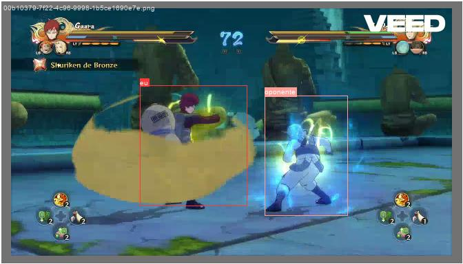
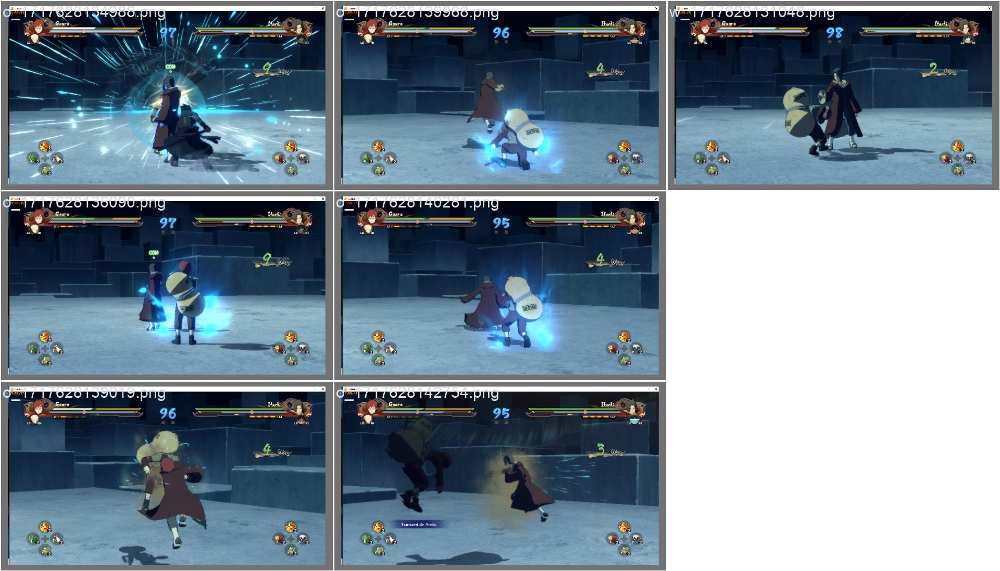

# Games we are training
- Naruto ultimate storm 4
- CS 1.6 / CS GO / CS 2

## index models
- [C-S-L-M](#Counter-Strike-Large-Model)
- [N-A-I](#N-A-I-156-imagens)

#
#
#
#
#
#
#
#
#
#
#
#
#
#
#
#
#
#
#
#
#
#
#-------------------C-S-L-M-------------------

# Counter Strike Large Model
- C-S-L-M 23.408 images YOLOv8n class 0 and 1 (complete)
- C-S-L-M 23.408 images YOLOv8x class 0 and 1 (Train)
- C-S-L-M create agent keyboard wasd123ctrlspace (waiting for the previous model to be trained)
- C-S-L-M 83.579 images YOLOv8x class only 0 (waiting for the previous model to be trained)
- C-S-L-M 152.529 images YOLOv8x class only 0 (waiting for the previous model to be trained)
- C-S-L-M 235.519 images YOLOv8x class only 0 (waiting for the previous model to be trained)
- C-S-L-M 295.379 images YOLOv8x class only 0 (waiting for the previous model to be trained)
- C-S-L-M 355.179 images YOLOv8x class only 0 (waiting for the previous model to be trained)
- C-S-L-M 465.179 images YOLOv8x class only 0 (waiting for the previous model to be trained)
- C-S-L-M 745.179 images YOLOv8x class only 0 (waiting for the previous model to be trained)

#
## 📚 index C-S-L-M model
- [C-S-L-M 23.408 images](#C-S-L-M-23k-images)
#
## index C-S-L-M dataset
- 

#
# C-S-L-M 23k images
- epochs: 5 
- Model summary (fused): 168 layers, 3006038 parameters, 0 gradients, 8.1 GFLOPs
- Speed: 0.8ms preprocess, 16.2ms inference, 0.0ms loss, 3.0ms postprocess per image
- metrics/mAP50-95(B): 0.16716
- metrics/mAP50(B): 0.36526
- metrics/precision(B): 0.3872
- imgsz: 640px
- batch: 16
- Hardware for train: Quadro P600 2gb,16ram
- time in training completed in 4.357 hours.
- YOLOv8x Parameters 3 M
- DOWNLOAD IN https://huggingface.co/ualerr/C-S-L-M/tree/main/C-S-L-M_23K

#
#
#
#
#
#
#
#
#
#
#
#
#
#
#
#
#
#
#
#
#
#
#-------------------N-A-I-------------------

#
# 📚 Naruto Artificial inteligence
- NAI 45 imagens (Available for download and use)
- NAI 156 imagens (Available for download and use)
- NAI 845 imagens (train)
- NAI 2k imagens (train)

## index N-A-I model

- [N-A-I 45 imagens](#N-A-I-45-imagens)
- [N-A-I 156 imagens](#N-A-I-156-imagens)
- [N-A-I 845 imagens](#N-A-I-845-imagens)
- [N-A-I 2k imagens](#N-A-I-2.228-imagens)

## index N-A-I dataset
- https://huggingface.co/datasets/ualerr/dataset_NAI_45_frames/
- https://huggingface.co/datasets/ualerr/data_NAI_200_frames/
- https://huggingface.co/datasets/ualerr/data_NAI_842_frames/

#
#
#
#
#
#
#
#
#
#
#
#
#
#
#
#
#
#
#
#
#
#
# N-A-I 2.228 imagens
#
#
# N-A-I 845 imagens
- 

#
# N-A-I 156 imagens
- epochs: 20
- metrics/mAP50-95(B): 0.16716
- metrics/mAP50(B): 0.36526
- metrics/precision(B): 0.3872
- imgsz: 640px
- batch: 1
- Hardware for train: Quadro P600 2gb,16ram
- time in training 5h
- YOLOv8x Parameters 68 M
- DOWNLOAD IN https://huggingface.co/ualerr/N-A-I/tree/main/naruto_v2
#
## 📚Example of 156 imagens

#
## 📚Results

#
#
## 📚Predict validation
- input 

- output

#
- input 

- output

#
#

# N-A-I 45 imagens
- epochs: 30
- metrics/mAP50-95(B): 0.3861
- metrics/mAP50(B): 0.62534
- metrics/precision(B): 0.73028
- imgsz: 640px
- batch: 16
- Hardware for train: 12cpu,16ram
- time in training: unknow
- YOLOv8n params: 3.2M	
- DOWNLOAD IN https://huggingface.co/ualerr/N-A-I/tree/main/naruto_v1
- 
## 📚Example of 45 imagens

#

## 📚Results

#
#
## 📚Predict validation
- input 

- output

- input 

- output

#

- CREDITS:
- https://github.com/inteligenciamilgrau/treinando_yolov8
- https://github.com/ultralytics/ultralytics

